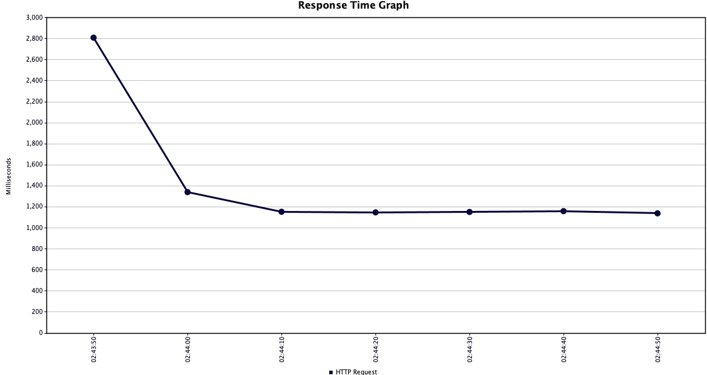
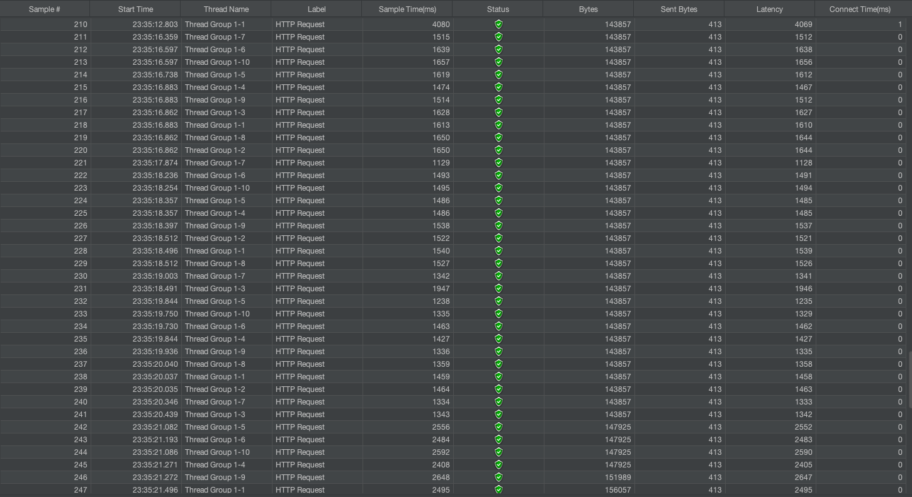
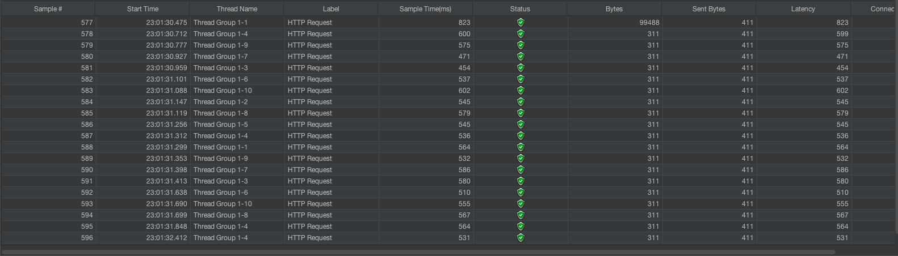

# Reduce Api Latency

> This repository offers resources for reducing latency through techniques, source code, and tutorials. Ideal for
> developers and engineers interested in optimizing network, computing, and data processing for real-world applications.

---

### Precautions

> During testing, variations may occur depending on the current computer resources.
> Additionally, due to several computer replacements, the metrics for images and text may differ.

### Project Spec

- SpringBoot 2.7.6
- Mysql 8.0
- Redis
- Kotlin by Java-11
- Spring MVC and Webflux

---

### Setup Project (Part.0)

> The initial project setup is done based on Spring MVC.

**Dependency**

```groovy
object DependencyVersion {
    const val KOTLIN_LOGGING_VERSION = "3.0.0"
    const val LOGBACK_ENCODER = "7.2"
}

dependencies {
    /** spring starter */
    implementation("org.springframework.boot:spring-boot-starter-web")
    implementation("org.springframework.boot:spring-boot-starter-validation")
    implementation("org.springframework.boot:spring-boot-starter-data-jpa")
    implementation("org.springframework.boot:spring-boot-starter-data-redis")
    implementation("org.springframework.boot:spring-boot-starter-webflux")
    kapt("org.springframework.boot:spring-boot-configuration-processor")

    /** kotlin */
    implementation("org.jetbrains.kotlin:kotlin-reflect")
    implementation("org.jetbrains.kotlin:kotlin-stdlib-jdk8")
    implementation("com.fasterxml.jackson.module:jackson-module-kotlin")

    /** logger */
    implementation("io.github.microutils:kotlin-logging-jvm:${DependencyVersion.KOTLIN_LOGGING_VERSION}")
    implementation("net.logstash.logback:logstash-logback-encoder:${DependencyVersion.LOGBACK_ENCODER}")

    /** mysql */
    runtimeOnly("mysql:mysql-connector-java")

    /** etc */
    developmentOnly("org.springframework.boot:spring-boot-devtools")
}
```

**DDL Scripts**

```sql
-- CREATE TABLE
CREATE
DATABASE reduce_api_latency CHARACTER SET utf8mb4 COLLATE utf8mb4_general_ci;

CREATE TABLE `test_1`
(
    `id`          bigint NOT NULL AUTO_INCREMENT,
    `title`       varchar(255) DEFAULT NULL,
    `description` varchar(255) DEFAULT NULL,
    `createdAt`   datetime     DEFAULT CURRENT_TIMESTAMP,
    `modifiedAt`  datetime     DEFAULT CURRENT_TIMESTAMP ON UPDATE CURRENT_TIMESTAMP,
    PRIMARY KEY (`id`)
) ENGINE=InnoDB DEFAULT CHARSET=utf8mb4 COLLATE=utf8mb4_general_ci;

CREATE TABLE `test_2`
(
    `id`          bigint NOT NULL AUTO_INCREMENT,
    `title`       varchar(255) DEFAULT NULL,
    `description` varchar(255) DEFAULT NULL,
    `createdAt`   datetime     DEFAULT CURRENT_TIMESTAMP,
    `modifiedAt`  datetime     DEFAULT CURRENT_TIMESTAMP ON UPDATE CURRENT_TIMESTAMP,
    PRIMARY KEY (`id`)
) ENGINE=InnoDB DEFAULT CHARSET=utf8mb4 COLLATE=utf8mb4_general_ci;

CREATE TABLE `test_3`
(
    `id`          bigint NOT NULL AUTO_INCREMENT,
    `title`       varchar(255) DEFAULT NULL,
    `description` varchar(255) DEFAULT NULL,
    `createdAt`   datetime     DEFAULT CURRENT_TIMESTAMP,
    `modifiedAt`  datetime     DEFAULT CURRENT_TIMESTAMP ON UPDATE CURRENT_TIMESTAMP,
    PRIMARY KEY (`id`)
) ENGINE=InnoDB DEFAULT CHARSET=utf8mb4 COLLATE=utf8mb4_general_ci;

CREATE TABLE `test_4`
(
    `id`          bigint NOT NULL AUTO_INCREMENT,
    `title`       varchar(255) DEFAULT NULL,
    `description` varchar(255) DEFAULT NULL,
    `createdAt`   datetime     DEFAULT CURRENT_TIMESTAMP,
    `modifiedAt`  datetime     DEFAULT CURRENT_TIMESTAMP ON UPDATE CURRENT_TIMESTAMP,
    PRIMARY KEY (`id`)
) ENGINE=InnoDB DEFAULT CHARSET=utf8mb4 COLLATE=utf8mb4_general_ci;

```

**application.yml**

```yaml
spring:
  datasource:
    url: jdbc:mysql://localhost:3306/reduce_api_latency?useUnicode=true&charset=utf8mb4&characterEncoding=utf8&zeroDateTimeBehavior=convertToNull&serverTimezone=Asia/Seoul
    driver-class-name: com.mysql.cj.jdbc.Driver
    username: root
    password:
    hikari:
      minimum-idle: 10
      maximum-pool-size: 20
  jpa:
    show-sql: true
    hibernate:
      ddl-auto: none
    open-in-view: false
  redis:
    host: localhost
    port: 6379

```

---

### Basic Api Setup (Part.0)

> Based on the provided description, it appears that the API operates synchronously with 4 database queries, 4 Redis
> queries, and 4 CPU computation steps. Finally, it makes 4 calls to the Google Search Trend API. The average latency for
> these operations falls between 1.5 seconds to 2 seconds.

```kotlin
fun getTestV1(request: TestRequest): TestResponse {
    /** Database */
    val test1Model = test1Repository.findAllById(request.test1Id)
        .map { test1 -> Test1Model.from(test1) }
    val test2Model = test2Repository.findAllById(request.test2Id)
        .map { test2 -> Test2Model.from(test2) }
    val test3Model = test3Repository.findAllById(request.test3Id)
        .map { test3 -> Test3Model.from(test3) }
    val test4Model = test4Repository.findAllById(request.test4Id)
        .map { test4 -> Test4Model.from(test4) }

    /** Redis Cache */
    val test1Cache = cacheService.get("test1:key:${request.test1Id}")
    val test2Cache = cacheService.get("test2:key:${request.test2Id}")
    val test3Cache = cacheService.get("test3:key:${request.test3Id}")
    val test4Cache = cacheService.get("test4:key:${request.test4Id}")

    /** Cpu Logic */
    val result1 = mathEngine.execute()
    val result2 = mathEngine.execute()
    val result3 = mathEngine.execute()
    val result4 = mathEngine.execute()

    /** WebClient Api Call */
    val realTrend1 = runBlocking { googleClient.getRealTimeTrends() }
    val realTrend2 = runBlocking { googleClient.getRealTimeTrends() }
    val realTrend3 = runBlocking { googleClient.getRealTimeTrends() }
    val realTrend4 = runBlocking { googleClient.getRealTimeTrends() }

    return TestResponse.of(
        cacheModel = TestCacheModel(
            test1 = test1Cache,
            test2 = test2Cache,
            test3 = test3Cache,
            test4 = test4Cache
        ),
        test1s = test1Model,
        test2s = test2Model,
        test3s = test3Model,
        test4s = test4Model,
        result = listOf(result1, result2, result3, result4),
        trendModels = listOf(realTrend1, realTrend2, realTrend3, realTrend4)
    )
}
```

**Add coroutine dependencies to use runBlocking.**

```kotlin
const val COROUTINE_VERSION = "1.6.4"

/** coroutine */
implementation("org.jetbrains.kotlinx:kotlinx-coroutines-reactor")
implementation("org.jetbrains.kotlinx:kotlinx-coroutines-jdk8:${DependencyVersion.COROUTINE_VERSION}")
implementation("io.projectreactor.kotlin:reactor-kotlin-extensions")
```

**Example API CURL**

```
curl --request GET \
  --url 'http://localhost:8080/api/ral/v1/test?test1Id=1&test1Id=2&test1Id=3&test1Id=4&test1Id=5&test1Id=6&test1Id=7&test2Id=1&test2Id=2&test2Id=3&test2Id=4&test2Id=5&test2Id=6&test2Id=7&test3Id=1&test3Id=2&test3Id=3&test3Id=4&test3Id=5&test3Id=6&test3Id=7&test4Id=1&test4Id=2&test4Id=3&test4Id=4&test4Id=5&test4Id=6&test4Id=7'
```

**Jmeter Test Report**

> Test after setting up with 10 user calls 10 times.
> The average latency is approximately 1.5 to 3 seconds.





---

### Reduce Api Latency By Async and CompletableFuture (Part.1)

> Using @Async and CompletableFuture to reduce API latency. We were able to achieve more than a fourfold performance
> improvement compared to the v1 API. However, we also experienced thread wastage due to excessive use of @Async.
> Managing threads has proven to be challenging, with concerns about resource wastage. Additionally, there's a risk of
> running into thread shortages.

```kotlin
@Service
class TestV2AsyncService(
    private val test1Repository: Test1Repository,
    private val test2Repository: Test2Repository,
    private val test3Repository: Test3Repository,
    private val test4Repository: Test4Repository,
    private val cacheService: CacheService,
    private val mathEngine: MathEngine,
    private val googleClient: GoogleClient
) {
    @Async(value = "taskExecutor")
    fun asyncFindAllByIdTest1(ids: Set<Long>): CompletableFuture<List<Test1Model>> {
        return CompletableFuture.completedFuture(
            test1Repository.findAllById(ids)
                .map { test1 -> Test1Model.from(test1) }
        )
    }

    @Async(value = "taskExecutor")
    fun asyncFindAllByIdTest2(ids: Set<Long>): CompletableFuture<List<Test2Model>> {
        return CompletableFuture.completedFuture(
            test2Repository.findAllById(ids)
                .map { test2 -> Test2Model.from(test2) }
        )
    }

    @Async(value = "taskExecutor")
    fun asyncFindAllByIdTest3(ids: Set<Long>): CompletableFuture<List<Test3Model>> {
        return CompletableFuture.completedFuture(
            test3Repository.findAllById(ids)
                .map { test3 -> Test3Model.from(test3) }
        )
    }

    @Async(value = "taskExecutor")
    fun asyncFindAllByIdTest4(ids: Set<Long>): CompletableFuture<List<Test4Model>> {
        return CompletableFuture.completedFuture(
            test4Repository.findAllById(ids)
                .map { test4 -> Test4Model.from(test4) }
        )
    }

    @Async(value = "taskExecutor")
    fun asyncMathEngine(): CompletableFuture<String> {
        return CompletableFuture.completedFuture(
            mathEngine.execute()
        )
    }

    @Async(value = "taskExecutor")
    fun asyncGetCache(key: String): CompletableFuture<String> {
        return CompletableFuture.completedFuture(
            cacheService.get(key)
        )
    }

    @Async(value = "taskExecutor")
    fun asyncGetRealTrend(): CompletableFuture<GoogleRealTimeSearchTrendModel> {
        return CompletableFuture.completedFuture(
            runBlocking { googleClient.getRealTimeTrends() }
        )
    }
}
```

```kotlin
@Service
class TestV2Service(
    private val testV2AsyncService: TestV2AsyncService
) {
    fun getTestV2(request: TestRequest): TestResponse {
        /** Database */
        val test1ModelCf = testV2AsyncService.asyncFindAllByIdTest1(request.test1Id)
        val test2ModelCf = testV2AsyncService.asyncFindAllByIdTest2(request.test2Id)
        val test3ModelCf = testV2AsyncService.asyncFindAllByIdTest3(request.test3Id)
        val test4ModelCf = testV2AsyncService.asyncFindAllByIdTest4(request.test4Id)

        /** Redis Cache */
        val test1CacheCf = testV2AsyncService.asyncGetCache("test1:key:${request.test1Id}")
        val test2CacheCf = testV2AsyncService.asyncGetCache("test2:key:${request.test2Id}")
        val test3CacheCf = testV2AsyncService.asyncGetCache("test3:key:${request.test3Id}")
        val test4CacheCf = testV2AsyncService.asyncGetCache("test4:key:${request.test4Id}")

        /** Cpu Logic */
        val result1Cf = testV2AsyncService.asyncMathEngine()
        val result2Cf = testV2AsyncService.asyncMathEngine()
        val result3Cf = testV2AsyncService.asyncMathEngine()
        val result4Cf = testV2AsyncService.asyncMathEngine()

        /** WebClient Api Call */
        val realTrend1Cf = testV2AsyncService.asyncGetRealTrend()
        val realTrend2Cf = testV2AsyncService.asyncGetRealTrend()
        val realTrend3Cf = testV2AsyncService.asyncGetRealTrend()
        val realTrend4Cf = testV2AsyncService.asyncGetRealTrend()

        /** join all completable futures */
        CompletableFuture.allOf(
            test1ModelCf, test2ModelCf, test3ModelCf, test4ModelCf,
            test1CacheCf, test2CacheCf, test3CacheCf, test4CacheCf,
            result1Cf, result2Cf, result3Cf, result4Cf,
            realTrend1Cf, realTrend2Cf, realTrend3Cf, realTrend4Cf
        ).join()

        return TestResponse.of(
            cacheModel = TestCacheModel(
                test1 = test1CacheCf.get(),
                test2 = test2CacheCf.get(),
                test3 = test3CacheCf.get(),
                test4 = test4CacheCf.get()
            ),
            test1s = test1ModelCf.get(),
            test2s = test2ModelCf.get(),
            test3s = test3ModelCf.get(),
            test4s = test4ModelCf.get(),
            result = listOf(result1Cf.get(), result2Cf.get(), result3Cf.get(), result4Cf.get()),
            trendModels = listOf(realTrend1Cf.get(), realTrend2Cf.get(), realTrend3Cf.get(), realTrend4Cf.get())
        )
    }
}
```

```kotlin
@EnableAsync
@Configuration
class AsyncConfig : AsyncConfigurerSupport() {
    @Bean("taskExecutor")
    fun taskExecutor(): ThreadPoolTaskExecutor {
        return ExecutorGenerator(
            threadName = "taskExecutor",
            corePoolSize = 10,
            maxPoolSize = 20,
            queueCapacity = 20
        ).generate()
    }
}

class ExecutorGenerator(
    private val threadName: String,
    private val corePoolSize: Int = DEFAULT_EXECUTOR_CORE_POOL_SIZE,
    private val maxPoolSize: Int = DEFAULT_EXECUTOR_MAX_POOL_SIZE,
    private val queueCapacity: Int = DEFAULT_EXECUTOR_QUEUE_CAPACITY
) {
    private val logger = mu.KotlinLogging.logger {}

    companion object {
        const val DEFAULT_EXECUTOR_CORE_POOL_SIZE = 5
        const val DEFAULT_EXECUTOR_MAX_POOL_SIZE = 10
        const val DEFAULT_EXECUTOR_QUEUE_CAPACITY = 10
    }

    fun generate(): ThreadPoolTaskExecutor {
        val threadPoolTaskExecutor = ThreadPoolTaskExecutor()

        threadPoolTaskExecutor.corePoolSize = this.corePoolSize
        threadPoolTaskExecutor.maxPoolSize = this.maxPoolSize
        threadPoolTaskExecutor.queueCapacity = this.queueCapacity
        threadPoolTaskExecutor.setThreadNamePrefix("${this.threadName}-")
        threadPoolTaskExecutor.setTaskDecorator(AsyncTaskDecorator())
        threadPoolTaskExecutor.setRejectedExecutionHandler(AsyncRejectedExecutionHandler())
        threadPoolTaskExecutor.initialize()

        logger.info { "generate ThreadPoolTaskExecutor / threadName $threadName / corePoolSize $corePoolSize / maxPoolSize $maxPoolSize / queueCapacity $queueCapacity" }

        return threadPoolTaskExecutor
    }
}
```

**Example API CURL**

```
curl --request GET \
  --url 'http://localhost:8080/api/ral/v2/test?test1Id=1&test1Id=2&test1Id=3&test1Id=4&test1Id=5&test1Id=6&test1Id=7&test2Id=1&test2Id=2&test2Id=3&test2Id=4&test2Id=5&test2Id=6&test2Id=7&test3Id=1&test3Id=2&test3Id=3&test3Id=4&test3Id=5&test3Id=6&test3Id=7&test4Id=1&test4Id=2&test4Id=3&test4Id=4&test4Id=5&test4Id=6&test4Id=7'
```

**Jmeter Test Report**

> Test after setting up with 10 user calls 10 times.
> The average latency is approximately 300ms to 350ms.


---

### Reduce Api Latency By Coroutines (Part.2)

> Using Coroutines, we were able to reduce API latency and achieve more than a fourfold performance improvement compared
> to the v1 API.
> Additionally, we significantly reduced thread wastage compared to v2.

```kotlin
class TestV3Service(
    private val test1Repository: Test1Repository,
    private val test2Repository: Test2Repository,
    private val test3Repository: Test3Repository,
    private val test4Repository: Test4Repository,
    private val cacheService: CacheService,
    private val mathEngine: MathEngine,
    private val googleClient: GoogleClient,
) {
    suspend fun getTestV3(request: TestRequest): TestResponse {
        return coroutineScope {
            /** Database */
            val test1Model = async(Dispatchers.IO) {
                test1Repository.findAllById(request.test1Id).map { test1 -> Test1Model.from(test1) }
            }
            val test2Model = async(Dispatchers.IO) {
                test2Repository.findAllById(request.test2Id).map { test2 -> Test2Model.from(test2) }
            }
            val test3Model = async(Dispatchers.IO) {
                test3Repository.findAllById(request.test3Id).map { test3 -> Test3Model.from(test3) }
            }
            val test4Model = async(Dispatchers.IO) {
                test4Repository.findAllById(request.test4Id).map { test4 -> Test4Model.from(test4) }
            }

            /** Redis Cache */
            val test1Cache = async(Dispatchers.IO) {
                cacheService.get("test1:key:${request.test1Id}")
            }
            val test2Cache = async(Dispatchers.IO) {
                cacheService.get("test2:key:${request.test2Id}")
            }
            val test3Cache = async(Dispatchers.IO) {
                cacheService.get("test3:key:${request.test3Id}")
            }
            val test4Cache = async(Dispatchers.IO) {
                cacheService.get("test4:key:${request.test4Id}")
            }

            /** Cpu Logic */
            val result1 = async(Dispatchers.Default) {
                mathEngine.execute()
            }
            val result2 = async(Dispatchers.Default) {
                mathEngine.execute()
            }
            val result3 = async(Dispatchers.Default) {
                mathEngine.execute()
            }
            val result4 = async(Dispatchers.Default) {
                mathEngine.execute()
            }

            /** WebClient Api Call */
            val realTrend1 = async(Dispatchers.IO) { googleClient.getRealTimeTrends() }
            val realTrend2 = async(Dispatchers.IO) { googleClient.getRealTimeTrends() }
            val realTrend3 = async(Dispatchers.IO) { googleClient.getRealTimeTrends() }
            val realTrend4 = async(Dispatchers.IO) { googleClient.getRealTimeTrends() }

            TestResponse.of(
                cacheModel = TestCacheModel(
                    test1 = test1Cache.await(),
                    test2 = test2Cache.await(),
                    test3 = test3Cache.await(),
                    test4 = test4Cache.await()
                ),
                test1s = test1Model.await(),
                test2s = test2Model.await(),
                test3s = test3Model.await(),
                test4s = test4Model.await(),
                result = listOf(result1.await(), result2.await(), result3.await(), result4.await()),
                trendModels = listOfNotNull(
                    realTrend1.await(),
                    realTrend2.await(),
                    realTrend3.await(),
                    realTrend4.await()
                )
            )
        }
    }
}
```

**Example API CURL**

```
curl --request GET \
  --url 'http://localhost:8080/api/ral/v3/test?test1Id=1&test1Id=2&test1Id=3&test1Id=4&test1Id=5&test1Id=6&test1Id=7&test2Id=1&test2Id=2&test2Id=3&test2Id=4&test2Id=5&test2Id=6&test2Id=7&test3Id=1&test3Id=2&test3Id=3&test3Id=4&test3Id=5&test3Id=6&test3Id=7&test4Id=1&test4Id=2&test4Id=3&test4Id=4&test4Id=5&test4Id=6&test4Id=7'
```

**Jmeter Test Report**

> Test after setting up with 10 user calls 10 times.
> The average latency is approximately 280ms to 330ms.




---
